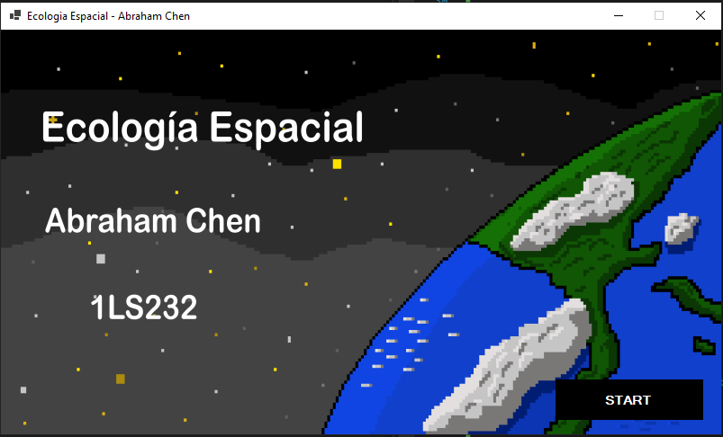
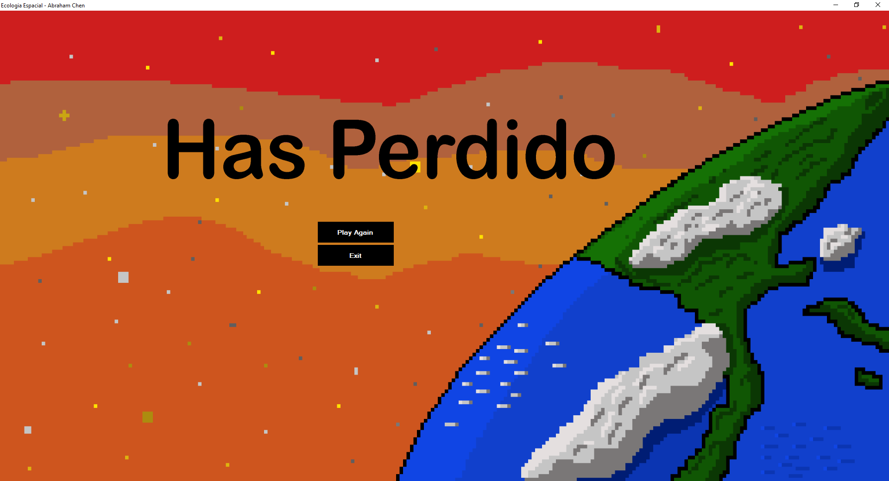
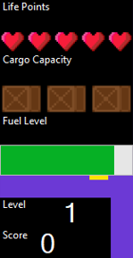

# Ecología Espacial 
Un proyecto para ayudar al medio ambiente espacial.

## Herramientas de Desarrollo:
 - [x] Visual Studio.

 - [x] Visual Basic.

 - [x] Piskel.

 - [x] Herramientas de edición para el reescalado de imagenes.

## Elementos

 1. **Inicio:** Permite al usuario Iniciar el Juego.

    

 2. **Nave:** Objeto jugable representa al jugador.
 
     
    

 3. **Desechos:** Objeto que puede ser recolectado por la nave.

     

 3. **Asteroides:** Obstaculos que pueden destruir la nave.

     

 4. **Plataforma:** Utilizada para depositar los desechos.
    
     

 5. **Puntos de Vida:** Representa los *LP* que posee el jugador actualmente.

     
 
 6. **Carga:** Representa la carga en tiempo real de la nave.

     

 7. **Combustible:** Indica la cantidad de combustible actual de la nave, Tiempo de vuelo restante de la nave.

    

 8. **Fin:**  Indica el Final del juego al perder todas las vidas. 

    

 9. **Interfaz de Usaurio:** Le muestra al usuario cada uno de los aspectos de la nave, ej. nivel, carga, vida.
    
     

 
 ## Mapas
Elemento de Ambientación.

 

